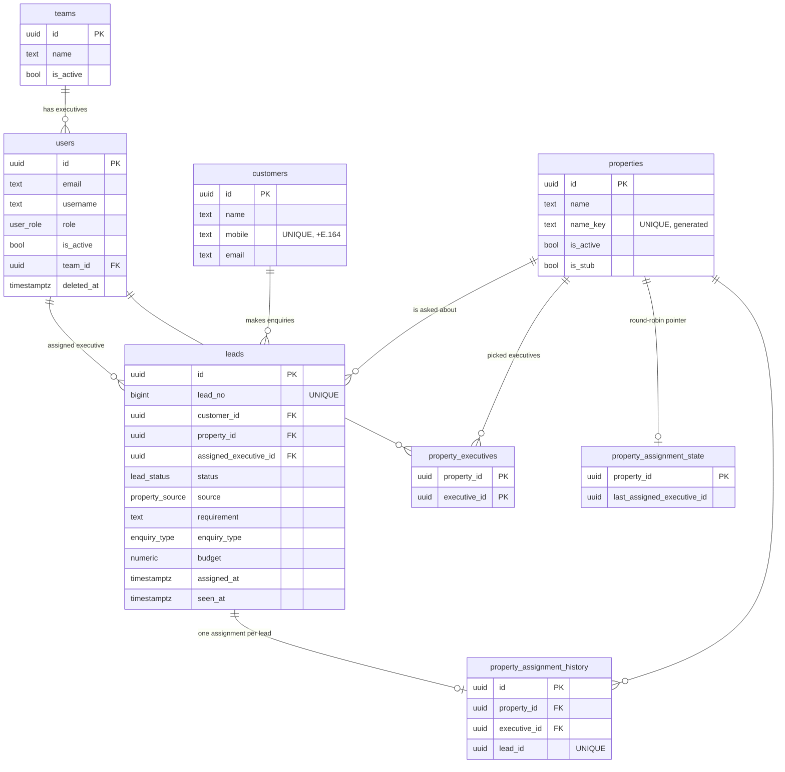

# Architecture

How the backend is built, how data flows, and the rules a change must not break. Setup and commands are in the [README](../README.md).

## 1. Request lifecycle

```
HTTP request
  → helmet, CORS (only if CORS_ORIGINS is set), JSON body (100kb limit)
  → /api/v1/auth/*        login (rate-limited), /auth/me
  → /api/v1/admin/*       authenticate() → authorizeRoles('ADMIN')      → module routers
  → /api/v1/manager/*     authenticate() → authorizeRoles('MANAGER')    → module routers
  → /api/v1/executive/*   authenticate() → authorizeRoles('SALES')      → module routers
  → route:   validateBody(zodSchema)  → controller → service → repository → Postgres
  → errors:  notFoundHandler → errorHandler  (always JSON, never leaks SQL)
```

- `src/app.ts` builds the app; `src/server.ts` only listens and shuts down gracefully (closes the HTTP server, then the DB pool).
- **Errors:** services throw `AppError(status, message, details?)` or `NotFoundError`. `errorHandler` turns them into `{ success:false, message, errors? }`. It also maps Postgres constraint violations: unique → `409` (friendly text per constraint in `UNIQUE_MESSAGES`), foreign key → `409`, not-null/check/invalid → `400`. Anything else is a generic `500`.
- **Validation:** Zod schemas live in `*.validation.ts`. Bodies use `z.strictObject`, so **unknown fields are rejected** (`400`). Query strings are parsed with `parse(schema, req.query)`.
- **Roles and users:** `ADMIN`, `MANAGER`, `SALES` (`user_role`). `users.designation` (`MANAGER`, `SALES_EXECUTIVE`, `EXECUTIVE_MANAGER`) is a label only; a database check ties it to the role. Sales Executive and Executive Manager are one role, so no code branches on the designation. Admins create all accounts; the executives service is one implementation parameterised by role, used for both `/admin/executives` (SALES) and `/admin/managers` (MANAGER).
- **Teams and managers:** `teams.manager_id` points at the manager who leads the team; sales users join through `users.team_id`. A manager's reach is derived from it: *their* sales users = members of teams where `manager_id` is them.
- **Auth:** each role signs in through its own endpoint (admin, manager, executive) with email or username, and gets a JWT carrying the role. The role guard rejects the wrong role with `403`. Passwords are hashed with argon2. `users.password_changed_at` invalidates tokens issued before a password change. There are no refresh tokens (1 h expiry).
- **Soft delete:** executives are never hard-deleted (`users.deleted_at`). History (leads, assignments) keeps pointing at them.

## 2. Database

PostgreSQL, SQL migrations in `migrations/` (applied in numeric order, tracked in the `pgmigrations` table).

| Migration | Adds |
|---|---|
| 001 | `users` (roles `ADMIN` / `EXECUTIVE`), `set_updated_at()` trigger |
| 002 | `teams`; `users.username`, `team_id`, `deleted_at` |
| 003 | properties + first assignment design (since reworked by 007) |
| 004 | `customers` (clients), `leads` |
| 005 | `users.password_changed_at` |
| 006 | `leads.budget`, `leads.property_name` |
| 007 | property executives + round-robin state, `PENDING_ASSIGNMENT`, unique property names; drops the old team/primary-executive columns |
| 008 | `leads.lead_no`, `requirement`, `assigned_at`, `seen_at`; `customers.type` |
| 009 | lead statuses become `INCOMING / RINGING / CONNECTED / CLOSED / LOST / BROKER` |
| 010 | roles `ADMIN / MANAGER / SALES` (was `EXECUTIVE`), `users.designation`, `teams.manager_id`, `assignment_method` + `assigned_by_id` on the assignment history |
| 011 | `lead_important (user_id, lead_id)`: the per-user Important flag |
| 012 | `app_settings` (key/value), seeded with `assignment_rule = ROUND_ROBIN` |
| 013 | `lead_timeout_minutes` setting, `assignment_method` gains `TIMEOUT`, partial index `leads_timeout_idx` |
| 014 | the lead SLA default becomes 90 minutes (installs where no admin had saved a value; a saved value is kept) |



Key constraints (enforced by the database, not only the code):
- `customers.mobile` unique → one client per mobile. Mobiles are normalised first (`src/utils/mobile.ts`: `98765 43210`, `+91-98765-43210`, `09876543210` all become `+919876543210`).
- `properties.name_key` unique (generated: lower-case, trimmed, collapsed spaces) → one property per name, even under concurrency.
- `leads (source, external_lead_id)` unique → a portal retry or duplicate webhook cannot create a second lead.
- `property_assignment_history.lead_id` unique → a lead is assigned at most once.
- Foreign keys use `ON DELETE RESTRICT`: clients, leads and properties with history cannot be hard-deleted.

## 3. The lead flow (`modules/leads/lead.service.ts → createLead`)

One database **transaction** covers everything, so a lead is never stored half-processed.

1. If `externalLeadId` is given and a lead with the same `source` + id exists, return it (`200`). This makes retries idempotent.
2. `findOrCreateStub(name)`: `INSERT … ON CONFLICT (name_key) DO NOTHING`, then select. Many simultaneous leads for a new property still create one property.
3. `upsertByMobile(...)`: find or create the client. An existing client keeps their name and type; a missing email is filled in.
4. Insert the lead as `PENDING_ASSIGNMENT`.
5. `propertyAssignmentService.assignLeadToProperty(propertyId, leadId, tx)` reads the **active assignment rule** (setting `assignment_rule`, default and only value today `ROUND_ROBIN`; changed through `PUT /admin/settings/assignment-rule`, ADMIN only) inside the transaction and runs that rule's strategy (`assignment.strategies.ts`). Round robin:
   - property row locked `FOR SHARE`, round-robin state row locked `FOR UPDATE` (concurrent leads queue per property);
   - candidates = executives in `property_executives` for that property who are `EXECUTIVE`, not deleted and available (`AvailabilityService`; today "available" means `is_active`);
   - next after `last_assigned_executive_id` in stable order (`users.created_at, id`), wrapping around; the pointer survives the last executive being deactivated or removed;
   - writes the history row and advances the pointer.
6. Assigned → `markAssigned` sets `status = INCOMING`, `assigned_at = now()`, `seen_at = NULL`. Nobody available → the lead stays `PENDING_ASSIGNMENT` and the response carries a `notice`.
7. An **inactive property** rejects the lead with `409` and the transaction rolls back (nothing is stored).

**Manual assignment** (`lead.service.ts → assignLead`, `PATCH /admin/leads/:id/assign` and `PATCH /manager/leads/:id/assign`): an admin may give any lead to any active SALES user; a manager only leads in their scope (their teams' leads plus `PENDING_ASSIGNMENT` ones) and only to SALES users of teams they lead. It reassigns the lead, resets `assigned_at`/`seen_at` so it is "new" for the receiver, moves a pending lead to `INCOMING` (other statuses are kept), and writes a `MANUAL` history row with `assigned_by_id`. It does not touch the round-robin pointer. The "one assignment per lead" unique index applies to `ROUND_ROBIN` rows only.

**When an admin sets a property's executives** (`PUT /admin/properties/:id/executives`), the list is replaced and `assignPendingLeads` assigns that property's waiting leads, oldest first, through the same round-robin, in the same transaction.

**Executive awareness:** `leads.assigned_at` / `seen_at` drive `isNew`. `GET /executive/leads/:id` sets `seen_at` on first open. The list orders unopened leads first. `GET /executive/leads/summary` returns the counts. Polling with `assignedSince` (compared at millisecond precision) finds newly assigned leads.

**Important flag:** `lead_important` holds one row per (user, lead). Lead reads take the logged-in user's id (`viewerId`) and compute `isImportant` with an `EXISTS` on that table, so the flag is always the viewer's own and never leaks between users. `POST`/`DELETE …/leads/:id/important` exist in each portal router and check the lead is visible to that role first (admin any, manager scope, sales own), so the flag follows the existing access rules; both calls are idempotent.

**Client history:** lead detail returns the client's other leads (`customerHistory`) through the `customer_id` relationship. No client data is copied into leads.

**Lead SLA / timeout:** a lead still `INCOMING` `lead_timeout_minutes` (admin setting, default 90, counted 24/7: plain elapsed time, no working hours) after `assigned_at` is moved to the next eligible executive by the active rule, repeatedly, until its status leaves `INCOMING`. `startLeadTimeoutJob` (in `server.ts`) runs `runLeadTimeoutSweep` on an interval; each lead is handled in its own transaction that locks it `FOR UPDATE SKIP LOCKED` and re-checks the condition, so concurrent sweeps (even on several instances) never reassign a lead twice. The history row is `TIMEOUT`; `assigned_at`/`seen_at` make it new for the receiver. Manual reassignment resets `assigned_at`, which restarts the clock; the Important flag is unrelated. The frontend view is in [`FRONTEND_ROUND_ROBIN_GUIDE.md`](FRONTEND_ROUND_ROBIN_GUIDE.md).

**Assignment from the frontend's side** (round robin, the rule and SLA settings, manual assignment, polling, every API and error): see [`FRONTEND_ROUND_ROBIN_GUIDE.md`](FRONTEND_ROUND_ROBIN_GUIDE.md).

**Adding an assignment rule:** add its name to `ASSIGNMENT_RULES` (`assignment.rules.ts`), implement a strategy that returns an executive id (or `null`) and register it in `ASSIGNMENT_STRATEGIES`, and widen the CHECK constraint on `app_settings` in a new migration. The settings endpoint, validation and the frontend dropdown (`availableRules`) pick it up from there. A strategy runs inside the assignment transaction after the property row is locked, so it must keep any state it needs safe under concurrent leads (round robin does this with a row lock).

## 4. Rules to keep when changing code

- All SQL stays in `*.repository.ts`; business rules in `*.service.ts`; controllers stay thin.
- Anything that creates or assigns a lead must run inside **one transaction** and accept a `Db` (pool or transaction client) so callers can compose it.
- Executives only ever see their own leads: the executive id comes from the token (`req.user.id`), never from the request. Someone else's lead is `404`, not `403`. The same goes for a manager's scope.
- Never branch permissions on `designation`; use `role`. Designation is display-only.
- Property names are never typed in by admins to create properties; leads create them. Admin work on a property is editing details and choosing executives.
- "Is this executive available?" lives only in `assignment/availability.service.ts`. Add leave or working-hours rules there, not in the assignment logic.
- New database objects go in a new numbered migration, never by editing an applied one.
- Add or update a test in `tests/` for every behaviour change. Tests run against real Postgres; keep concurrency cases when touching assignment.

## 5. Known limitations and ideas

- **No push notifications:** the dashboard polls. Server-sent events (single instance) or Postgres `LISTEN/NOTIFY` (multiple instances) would add real-time delivery.
- **No portal webhook yet:** leads are created through `POST /admin/leads`. `createLead()` is already the single entry point and is idempotent through `externalLeadId`, so a webhook only needs authentication (API key) and field mapping.
- **Lead statuses have no enforced order**, and there is no activity or notes timeline (only the lead's `message`).
- **Auth:** no refresh tokens, no password-reset flow.
- **Pagination** returns plain arrays without a total count.
